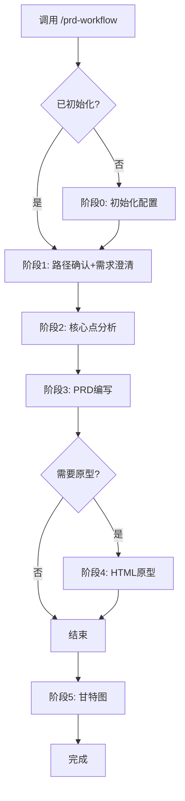

# PRD Workflow Plugin

产品需求文档工作流 - 从需求澄清到PRD、原型、甘特图的完整流程

## 安装

在 Claude Code 中运行：

```
/plugin install kelbyWong/prd-workflow-plugin
```

## 功能

| 命令 | 功能 | 说明 |
|------|------|------|
| `/prd-workflow` | 完整流程 | 阶段0→1→2→3→4→5 |
| `/prd-workflow quick` | 快速模式 | 紧急需求，跳过可选阶段 |
| `/prd-workflow html` | 仅原型 | PRD已完成，绘制HTML原型 |
| `/prd-workflow gantt` | 仅甘特图 | 开发评审后，生成甘特图 |

## 工作流程



## 输出目录结构

```
{需求名称}/
├── 需求调研/     ← 核心点文档
├── 需求文档/     ← PRD文档
├── 技术文档/
├── 测试文档/
├── 验收文档/
├── 其它文档/
└── HTML原型/
```

## 首次使用

首次运行 `/prd-workflow` 时会自动初始化：

1. 复制配置模板到个人配置目录
2. 询问文档仓库根目录（必须配置）
3. 完成后自动进入需求澄清阶段

## 模板配置

在文档仓库中创建模板目录：

```
{文档仓库根目录}/projects/workflow/prd-workflow/
├── （简单版本）产品需求文档
└── （完整版本）产品需求文档
```

## 作者

- GitHub: [@kelbyWong](https://github.com/kelbyWong)