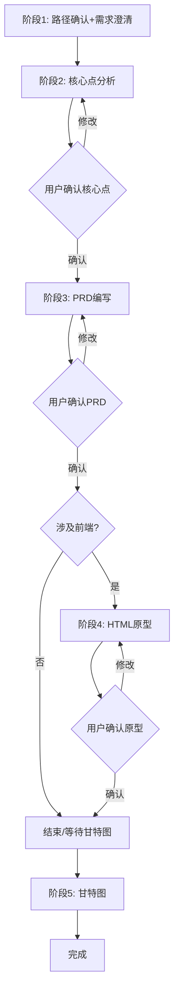

# PRD Workflow Skill 设计文档

## 一、概述

### 1.1 目标

创建一个产品需求文档工作流Skill，协助产品经理完成从需求澄清到PRD编写、HTML原型生成的完整流程。

### 1.2 适用场景

| 场景 | 说明 |
|------|------|
| 主版本功能优化 | 丰富系统本身功能 |
| 项目定制化功能 | 新业务项目的特定功能开发 |

### 1.3 输出物

| 输出 | 格式 | 位置 |
|------|------|------|
| 核心点文档 | Markdown | 需求调研目录 |
| PRD文档 | Markdown (Obsidian) | 求文档目录 |
| HTML原型 | HTML (带注释) | 需求文档目录 |
| 甘特图 | Mermaid gantt | PRD新增章节 |

---

## 二、Skill文件结构

```
~/.claude/skills/prd-workflow/
├── skill.md                    # 主Skill，流程编排
├── stages/
│   ├── 01-clarify.md           # 需求澄清+现状理解
│   ├── 02-core.md              # 核心点分析
│   ├── 03-prd.md               # PRD文档编写
│   ├── 04-prototype.md         # HTML原型生成（可选）
│   └── 05-gantt.md             # 甘特图生成（可选）
├── templates/
│   └── template-config.md      # 模板路径配置
└── references/
    ├── obsidian-syntax.md      # Obsidian语法参考
    └── mermaid-guide.md        # Mermaid图表指南
```

---

## 三、工作流阶段

### 阶段流程图



### 阶段详情

| 阶段 | 输入 | 输出 | 确认点 |
|------|------|------|--------|
| 1 | 用户调用+过程文件 | 路径确认+信息汇总 | 必须 |
| 2 | 信息+现状 | 核心点文档 | 必须 |
| 3 | 核心点 | PRD文档 | 必须 |
| 4 | PRD+组件配置 | HTML原型 | 必须（如有前端） |
| 5 | 开发评审结果 | 甘特图章节 | 可选 |

---

## 四、关键设计决策

### 4.1 交互方式

**智能询问模式：** 未得到或部分得到答案依次询问，已得到答案自动识别。

### 4.2 现状材料读取

**组件配置索引模式：** 用户输入模块名 → AI读取组件配置文档 → 定位目标组件，避免全前端扫描。

### 4.3 模板选择

**动态读取 + 判断规则：**
- 主版本功能优化 → 简单版本
- 项目定制化（新客户） → 完整版本

### 4.4 HTML原型生成

**增量式 + 注释标注：** 生成完整骨架，用注释标注改动区域（新增/修改/删除）。

### 4.5 甘特图处理

**独立章节 + 信息提取：**
- 新增章节，不替换原有时间线
- 人员配置从"利益相关决策者"表格提取

### 4.6 Obsidian特性支持

| 特性 | 支持 |
|------|------|
| 双链 `[[]]` | ✓ |
| Dataview查询 | ✓ |
| Callout语法 | ✓ |
| Mermaid渲染 | ✓ |

---

## 五、Memory记忆设计

**位置：** `~/.claude/projects/prd-workflow/memory/`

| 文件 | 用途 |
|------|------|
| user_profile.md | 用户身份、角色定位 |
| prd_config.md | 文档路径、项目集配置 |
| template_paths.md | 模板文件路径 |
| project_contacts.md | 各系统联系人 |
| feedback_history.md | 输出格式偏好 |

---

## 六、用户确认处理

| 确认类型 | 处理方式 |
|----------|----------|
| 简单修改 | 对话告诉AI，AI直接修改文档 |
| 复杂修改 | 用户在Obsidian自编辑，完成后回复"已确认，继续" |

---

## 七、不自动执行的操作

| 操作 | 原因 |
|------|------|
| Git操作 | 用户自主通过Sourcetree管理 |
| 推送总原型 | 上线后由前端开发更新 |

---

## 八、文件命名规范

| 文件 | 命名规则 |
|------|----------|
| 核心点文档 | `{需求名称}需求文档核心点.md` |
| PRD文档 | `{需求名称}需求文档.md` |
| HTML原型 | `{页面名称}原型.html` |

---

## 九、空章节处理规则

模板中无内容的章节填写"无"，不删除章节结构。

```markdown
## X. {章节名称}

无
```

---

**设计文档完成，请审阅。**