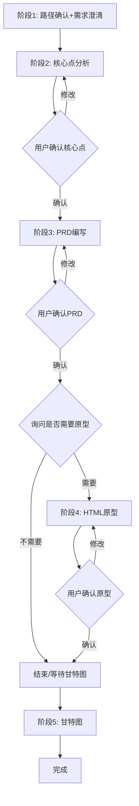

# PRD Workflow 完整工作流

> 本文档描述 `/prd-workflow` Skill 的完整执行流程

---

## 阶段1: 路径确认 + 需求澄清 + 现状理解

### 目标

确认输出位置、收集需求信息、理解系统现状

### Part A: 输出位置确认

依次询问（已提供则跳过）：

| 信息项 | 示例 |
|--------|------|
| 项目集 | tms / erpp / wms |
| 系统 | ETMS / GPS / RMS |
| 需求类型 | 主版本_功能优化 / 项目定制化功能 |
| 需求名称 | 费用审批优化 |

**输出路径构建：**
```
{文档仓库}/{项目集}/{系统}/需求文档/{需求类型}/{需求名称}/
```

### Part B: 过程文件确认

询问需求澄清的过程文件位置：
- 笔记文件、会议纪要、需求清单、录音转写
- 格式：.md 或 .txt

### Part C: 现状材料确认（可选）

询问是否需要阅读现有系统材料（按需提供，节省token）：
- 现有前端代码/原型
- 系统架构文档
- 历史需求文档

### Part D: 项目基础信息提取

**优先从过程文件提取：**
- 客户名称/编码
- 业务机会名称/编码
- 项目联系人

**询问补充：**
- 需求负责人（默认当前用户）

**记忆复用：**
从memory读取历史配置，询问"是否沿用上次信息？"

### Part E: 文件夹初始化

用户确认后创建目录结构：

```
{需求名称}/
├── 需求调研/
├── 需求文档/
├── 技术文档/
├── 测试文档/
├── 验收文档/
├── 其它文档/  ← 过程文件存放
└── HTML原型/
```

### 输出确认

展示信息摘要，用户确认后进入阶段2。

---

## 阶段2: 需求核心点分析

### 目标

分析需求要点，输出核心点文档供用户确认

### 前置条件

- 阶段1已完成
- 过程文件已放置在"其它文档"目录

### 分析步骤

**Step 1: 需求背景理解**
- 业务背景：为什么需要？
- 要解决的问题：痛点是什么？
- 业务场景：涉及哪些操作？

**Step 2: 功能范围界定**
- 涉及的系统模块
- 具体功能点列表
- 优先级（P0/P1/P2）

**Step 3: 现状对比（如有材料）**
- 现有功能：不需要重复设计
- 改动点：需修改/增强
- 新增点：全新功能

**原则：避免过度设计**

**Step 4: 前端变更判断**
- 涉及前端 → 阶段4可能需要原型
- 不涉及前端 → 阶段4跳过

**Step 5: 接口判断**
- 是否涉及外部系统接口对接

### 输出物

**文件：** `{需求名称}需求文档核心点.md`

**位置：** `{需求名称}/需求调研/`

**内容结构：**

```markdown
# {需求名称}需求文档核心点

## 一、业务背景
### 1.1 需求来源
### 1.2 要解决的问题

## 二、功能范围
### 2.1 涉及模块
### 2.2 功能点清单
### 2.3 与现有功能对比

## 三、前端变更判断
## 四、接口对接判断
## 五、风险预判
## 六、待确认事项
```

### 用户确认处理

- 简单修改 → 对话告诉AI
- 复杂修改 → 用户自编辑，回复"已确认"

---

## 阶段3: PRD文档编写

### 目标

根据核心点文档和模板，输出完整PRD文档

### 前置条件

- 核心点文档已用户确认
- 模板已内置（无需配置）

### 最终澄清询问（必须）

**在开始编写PRD文档前，必须询问用户：**

> "在开始编写PRD文档之前，还有什么信息需要补充或澄清吗？请补充需要澄清的内容，或回答"无，直接输出PRD文档"开始编写。"

| 用户回答 | 处理方式 |
|----------|----------|
| 补充内容 | AI记录补充信息，再次询问 |
| "无，直接输出PRD文档" | 开始执行PRD编写流程 |
| "返回核心点" | 回退到阶段2重新分析 |

### 模板选择

询问用户：

| 选项 | 适用场景 | 相对路径 |
|------|----------|----------|
| A. 简单版本 | 内部优化、功能增强 | `projects/workflow/prd-workflow/（简单版本）产品需求文档` |
| B. 完整版本 | 商业化产品、新项目 | `projects/workflow/prd-workflow/（完整版本）产品需求文档` |

**默认推荐：简单版本**

**模板路径拼接规则：**
`完整路径 = {文档仓库根目录} + {相对路径}`

同事使用方式：
1. 在文档仓库创建 `projects/workflow/prd-workflow/` 目录
2. 放入两个模板文件
3. 在 `prd_config.md` 配置自己的文档仓库根目录

### 文档编写步骤

**Step 1: 基础章节**

| 章节 | 来源 | Obsidian特性 |
|------|------|--------------|
| 文档变更日志 | 需求负责人+日期 | 标准表格 |
| 业务背景 | 核心点文档 | 双链 `[[]]` |
| 期望时间线 | 用户输入 | `mermaid timeline` |
| 项目联系人 | 过程文件 | 标准表格 |
| 需求背景 | 核心点文档 | Callout |

**Step 2: 流程图章节**

根据功能范围生成Mermaid：
- `flowchart TD` - 业务流程
- `sequenceDiagram` - 系统交互
- `stateDiagram-v2` - 状态流转

**Step 3: 需求列表**

从核心点转换：
- PC端需求表格
- 移动端需求表格（如有）
- 接口对接表格（如有）

人天填写规则：
- 需求分析 → 估算值
- 开发/测试/实施 → 0（待评审）

**Step 4: 风险评估**

从核心点风险预判转换

**Step 5: 安全隐私**

- 安全：默认"无新权限要求"
- 隐私：默认"无"

**Step 6: 项目成本**

- 需求调研：估算值
- 其他：0

**Step 7: 空章节**

填写"无"，不删除结构

**Step 8: 决策记录**

保留空框架供后续补充

### Obsidian特性支持

| 特性 | 用途 |
|------|------|
| 双链 `[[]]` | 引用相关文档 |
| Dataview | 自动汇总需求列表 |
| Callout | 提示信息块 |
| Mermaid | 流程图渲染 |

### 输出物

**文件：** `{需求名称}需求文档.md`

**位置：** `{需求名称}/需求文档/`

### 用户确认处理

- 简单修改 → 对话告诉AI
- 复杂修改 → 用户自编辑，回复"已确认"

---

## 阶段4: HTML原型生成（可独立调用）

### 目标

生成带改动标注的高保真HTML原型

### 执行时机

**两种模式：**

| 模式 | 说明 |
|------|------|
| A. 完整流程中 | `/prd-workflow` 流程自动进入 |
| B. 独立调用 | PRD已完成，只需绘制原型 |

**独立调用方式：**
- `/prd-workflow html`
- "生成HTML原型"
- "绘制原型"

### 独立调用流程（模式B）

**Step 1: 询问PRD文档位置**

> "请提供需要绘制原型的PRD文档路径"

**Step 2: 询问生成方式**

| 方式 | 说明 |
|------|------|
| A. 修改现有页面 | 基于现有前端，增量生成 |
| B. 新增页面 | 根据PRD直接生成 |

**Step 3: 询问现有材料来源（方式A时）**

| 来源 | 说明 |
|------|------|
| A. 组件配置索引 | 输入模块名，读取配置定位 |
| B. 直接提供文件 | 直接提供文件路径 |

### 完整流程中的处理（模式A）

**首步：询问是否需要原型**

> "是否需要生成HTML原型？
> - **需要** - 涉及前端页面变更
> - **不需要** - 仅后端逻辑变更"

| 选择 | 处理 |
|------|------|
| 不需要 | 跳过本阶段 |
| 需要 | 继续生成流程 |

### 现状材料策略

| 策略 | 适用场景 | 操作 |
|------|----------|------|
| A. 组件配置索引 | 修改现有页面 | 询问模块名 → 读取配置 → 定位组件 |
| B. 直接生成 | 新增页面 | 根据PRD直接生成 |
| C. 用户提供 | 用户明确目标 | 直接读取指定文件 |

### 增量式原型原则

**修改现有页面：**
1. 读取组件配置 → 了解结构
2. 读取目标组件 → 获取现有结构
3. 对比PRD → 标注改动
4. 输出完整骨架+注释

**新增页面：**
根据PRD+现有风格直接生成

### HTML结构规范

**文件头部：**

```html
<!--
============================================
原型文档说明
需求名称：{需求名称}
生成时间：{日期}
变更摘要：
- [新增] 字段：XXX
- [修改] 字段：XXX
============================================
-->
```

**改动标注：**

```html
<!-- [新增] 审批状态字段 -->
<!-- [修改] 费用金额 - 增加对比 -->
<!-- [删除] 手工录入按钮 -->
```

### 输出物

| 页面数量 | 位置 |
|----------|------|
| 单页面 | `{需求名称}/需求文档/{页面名}原型.html` |
| 多页面 | `{需求名称}/需求文档/HTML原型/` |

### 用户确认处理

- 简单修改 → 对话告诉AI
- 新增页面 → AI补充生成

---

## 阶段5: 甘特图生成（开发评审后）

### 目标

输出项目进度甘特图章节

### 执行时机

**不在PRD流程中自动执行**

需等待：
- PRD文档完成
- 开发团队评审
- 开发工作量确定

**调用方式：**
- `/prd-workflow gantt`
- 或告诉AI "生成甘特图"

### 信息提取

**Step 1: 从PRD提取**

| 章节 | 提取内容 |
|------|----------|
| 需求列表 | 开发/测试/实施人天 |
| 利益相关决策者 | 人员名单 |

**人员识别关键词：**
- 开发："开发"、"DL"
- 测试："测试"、"测试工程师"

**Step 2: 询问时间节点**

| 节点 | 说明 |
|------|------|
| KO项目 | 启动时间 |
| 功能开发开始 | 开发启动 |
| SIT测试开始 | 内部测试 |
| UAT测试开始 | 用户验收 |
| 上线培训 | 培训时间 |
| 系统上线 | 上线时间 |

**自动计算：**
- 开发周期 = 开发人天 ÷ 开发人数
- 测试周期 = 测试人天 ÷ 测试人数

### 输出物

**新增独立章节，不替换原有时间线**

**位置：** PRD文档末尾新增

**内容结构：**

```markdown
# {N}. 项目进度甘特图

## {N}.1 项目资源配置
| 角色 | 人员 | 人数 | 人天 | 周期 |

## {N}.2 项目进度甘特图
```mermaid
gantt
    title {需求名称} 项目进度
    dateFormat YYYY-MM-DD
    
    section 启动
    KO项目 :milestone, ko, {日期}
    
    section 开发
    功能开发 :dev, {天数}d
    
    section 测试
    SIT测试 :sit, {天数}d
    UAT测试 :uat, {天数}d
    
    section 上线
    系统上线 :milestone, launch, {日期}
```

## {N}.3 时间节点汇总
| 节点 | 计划日期 | 实际日期 | 状态 |
```

### 用户调校

- 时间调整 → 重新计算
- 人员调整 → 更新周期
- 并行任务 → 调整结构

---

## 流程总览



---

## 用户交互规范

| 确认类型 | 处理方式 |
|----------|----------|
| 简单修改 | 对话告诉AI，AI直接修改文档 |
| 复杂修改 | 用户在Obsidian自编辑，回复"已确认，继续" |

**Git操作：** Skill不自动执行，用户自主管理

---

## 调用方式汇总

| 调用场景 | 命令/方式 |
|----------|-----------|
| 完整流程 | `/prd-workflow` |
| 仅绘制原型 | `/prd-workflow html` |
| 仅绘制原型 | "生成HTML原型" / "绘制原型" |
| 仅生成甘特图 | `/prd-workflow gantt` |
| 仅生成甘特图 | "生成甘特图" |
| 快速模式 | `/prd-workflow quick` |

---

## 快速模式

**适用场景：** 紧急需求，快速输出核心文档

**调用：** `/prd-workflow quick`

| 正常模式 | 快速模式 |
|----------|----------|
| 阶段1~5全流程 | 阶段1→2→3→结束 |
| 每阶段等待确认 | 核心点确认后直接输出PRD |
| 详细询问 | 最小询问 |

快速模式自动跳过：
- HTML原型阶段
- 甘特图阶段
- 详细现状材料读取

---

## 回退与跳转

用户可在任意阶段说：

| 命令 | 效果 |
|------|------|
| "返回阶段X" | 回退到指定阶段重新处理 |
| "跳过原型" | 跳过阶段4，直接结束 |
| "暂停" | 保存进度，提示下次继续方式 |
| "继续" | 从上次暂停处继续 |

---

## PRD状态跟踪

### Frontmatter状态定义

```markdown
---
status: 编写中|待评审|开发中|测试中|已上线
updated_time: 2026-05-12
---
```

### 状态流转

| 状态 | 说明 | 触发时机 |
|------|------|----------|
| 编写中 | 文档编写阶段 | 创建时默认 |
| 待评审 | 等待开发评审 | PRD完成确认后 |
| 开发中 | 开发实施阶段 | 评审通过后 |
| 测试中 | 测试阶段 | 开发完成后 |
| 已上线 | 已部署上线 | UAT通过后 |

---

## 输出自检机制

PRD输出前自动执行自检：

| 检查项 | 规则 |
|--------|------|
| 必填章节完整性 | 文档变更日志、业务背景、需求列表必须有内容 |
| 表格数据完整性 | 需求列表至少有1条需求 |
| Mermaid语法检查 | 流程图关键字完整 |
| Frontmatter完整 | status、priority、created_time存在 |
| 双链引用检查 | 引用格式正确 |

发现问题自动修正，输出自检报告。

---

## 组件配置文档模板

**位置：** `templates/component-config-template.md`

**用途：** 记录前端组件信息，供AI快速定位目标文件

**使用方式：**
1. 复制模板到 `{需求类型}/组件配置/{模块名}-前端组件.md`
2. 根据实际前端代码填写
3. 定期维护更新

**模板包含：**
- 页面清单
- 组件清单
- 表单字段
- 按钮操作
- 表格列
- API接口
- 状态定义
- 样式规范