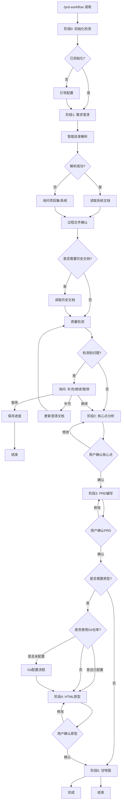
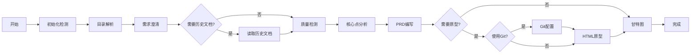
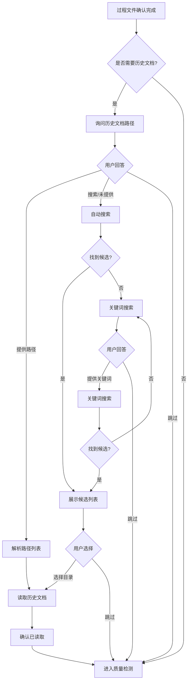
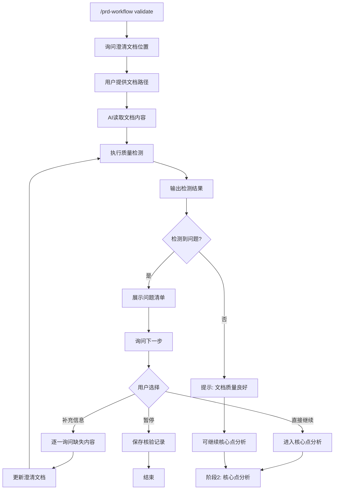
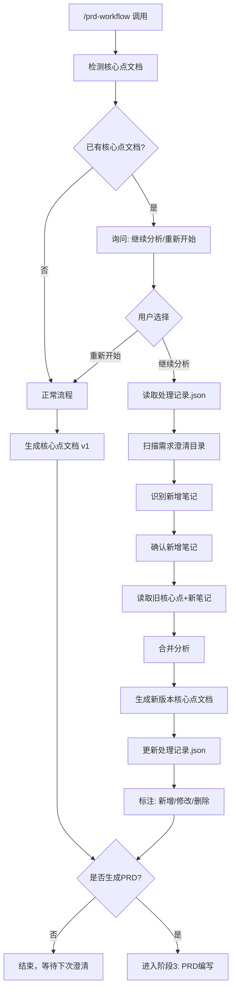

# PRD Workflow 使用手册

> 产品需求文档工作流培训手册

---

## 一、什么是 PRD Workflow？

PRD Workflow 是一个产品需求文档工作流工具，协助产品经理完成：

| 工作内容 | 输出物 |
|----------|--------|
| 需求澄清 | 信息汇总文档 |
| 核心点分析 | 需求文档核心点 |
| PRD编写 | 产品需求文档 |
| 原型绘制 | HTML原型页面 |
| 甘特图 | 项目进度甘特图 |

---

## 二、如何安装？

### 步骤1：安装 Claude Code

从官网下载安装 Claude Code 客户端。

### 步骤2：安装 Skill

在 Claude Code 对话框中输入：

```
/plugin marketplace add kelbyhuang88-sudo/prd-workflow-plugin
/plugin install kelbyhuang88-sudo/prd-workflow-plugin
```

等待安装完成。

### 步骤3：首次运行初始化

输入 `/prd-workflow`，首次运行会自动执行初始化：

1. 配置文档仓库根目录（必须）
2. 填写用户身份信息（可选，可跳过）

**注意：** Git 访问令牌配置会在原型阶段前询问，而非初始化阶段。

---

## 三、调用方式汇总

| 命令 | 功能 | 适用场景 |
|------|------|----------|
| `/prd-workflow` | 完整流程 | 正常需求开发 |
| `/prd-workflow quick` | 快速模式 | 紧急需求，快速输出PRD |
| `/prd-workflow core` | 仅核心点 | 已有澄清笔记，快速输出核心点分析 |
| `/prd-workflow validate` | 需求核验 | 检查澄清文档质量 |
| `/prd-workflow html` | 仅原型 | PRD已完成，只绘制原型 |
| `/prd-workflow gantt` | 仅甘特图 | 开发评审后，生成进度图 |
| `/prd-workflow git` | Git辅助原型 | 未配置→配置Git；已配置→使用Git辅助原型 |

**对话方式也可以触发：**

| 说这句话 | 相当于 |
|----------|--------|
| "核心点分析" | `/prd-workflow core` |
| "需求核验" | `/prd-workflow validate` |
| "绘制原型" | `/prd-workflow html` |
| "生成甘特图" | `/prd-workflow gantt` |
| "Git辅助原型" | `/prd-workflow git` |

---

## 四、完整工作流程

### 流程图



### 简化流程图



### 各阶段说明

| 阶段 | 做什么 | 你需要提供 |
|------|--------|------------|
| 0. 初始化 | 配置环境 | 文档仓库路径 |
| 1. 目录解析 | 智能检测项目集/系统 | 确认检测结果 |
| 1. 需求澄清 | 收集信息 | 澄清笔记、会议纪要 |
| 历史文档询问 | 阅读1期/2期等历史文档 | 提供路径或关键词搜索（可跳过） |
| 质量检测 | 检查文档质量 | 确认问题/补充信息 |
| 2. 核心点分析 | 分析需求要点 | 确认分析结果 |
| 3. PRD编写 | 编写需求文档 | 选择模板版本 |
| Git询问 | 是否使用Git仓库辅助原型 | 选择是否访问Git仓库（未配置时才询问配置） |
| 4. HTML原型 | 绘制页面原型 | 确认原型效果 |
| 5. 甘特图 | 生成进度图表 | 提供时间节点 |

---

## 四.1、历史文档询问功能（多期项目）

### 适用场景

| 场景 | 说明 |
|------|------|
| 二期/三期项目 | 需要了解一期已完成的功能范围 |
| 功能优化迭代 | 需要了解原功能设计背景 |
| 新产品经理接手 | 需要快速了解项目历史 |

### 流程图



### 如何提供历史文档路径？

**支持的分隔符（多个文档）：**
- `,`（英文逗号）
- `，`（中文逗号）
- `、`（顿号）
- 空格分隔

**示例：**
```
../费用审批优化一期/需求文档/费用审批需求文档.md，../费用审批优化二期/需求调研/需求文档核心点_v1.md
```

### 如何自动搜索？

如果用户未提供路径，AI会自动搜索：

1. 从当前需求目录往上找到 `project/` 锚点
2. 在系统层级往下扫描，匹配包含 `一期`、`二期`、`v1`、`v2` 等的目录
3. 展示候选列表供用户选择

### 找不到怎么办？

| 选项 | 说明 |
|------|------|
| **提供关键词** | 输入关键词（如"费用审批"、"一期"）让AI搜索 |
| **跳过** | 不读取历史文档，直接继续分析 |

---

## 五、需求核验功能详解

### 流程图



### 什么时候用？

| 场景 | 建议 |
|------|------|
| 澄清笔记写完后，不确定是否完整 | 用 `/prd-workflow validate` 检查 |
| 快速检查文档质量，不写核心点 | 用 `/prd-workflow validate` |
| 进入核心点分析前，想了解文档问题 | 流程中自动检测 |

### 检测哪些问题？

| 检测维度 | 具体检查什么 |
|----------|--------------|
| **信息完整性** | 业务背景、用户角色、业务场景是否写清楚 |
| **逻辑一致性** | 描述是否有矛盾或前后不一致 |
| **边界模糊** | "类似"、"大概"等模糊表述 |
| **场景缺失** | 异常场景、错误处理、边界情况是否覆盖 |
| **技术遗漏** | 接口依赖、数据来源是否说明 |

### 检测结果示例

AI会输出类似：

> **检测结果：**

| 问题类型 | 具体内容 | 建议 |
|----------|----------|------|
| 用户角色缺失 | 未说明审批层级和审批人 | 请补充：谁来审批？审批有几级？ |
| 边界模糊 | "类似于OA审批"不够明确 | 请明确：审批规则、超时处理方式 |
| 场景缺失 | 未说明审批拒绝后的处理 | 请补充：拒绝后可否重新提交？ |

> **请选择下一步：**
> - A. 补充信息 → 先补充缺失内容
> - B. 直接继续 → 问题记录到待确认事项
> - C. 暂停 → 稍后线下补充

---

## 六、继续分析模式

### 流程图



### 适用场景

当你有以下情况时：

| 场景 | 说明 |
|------|------|
| 第一次澄清后，发现问题需要二次澄清 | 有新笔记，要带着记忆继续分析 |
| 多次澄清，逐步完善需求 | 每次澄清后继续分析，版本递增 |
| 不想从零开始重新分析 | 基于上次结果，增量更新 |

### 如何触发？

当AI检测到已有核心点文档时，会自动询问：

> "检测到已有核心点文档（当前版本：v1），请选择：

| 选项 | 说明 |
|------|------|
| **A. 继续分析** | 带着记忆，结合新笔记继续分析 |
| **B. 重新开始** | 从零开始，生成新的核心点文档 |

选择 **A. 继续分析** 即可进入。

### 版本管理

每次继续分析会生成新版本：

```
需求调研/
├── 需求文档核心点_v1.md    ← 第一次分析
├── 需求文档核心点_v2.md    ← 第二次分析（带历史+增量）
├── 需求文档核心点_v3.md    ← 第三次分析
└── 处理记录.json           ← 记录哪些笔记已使用
```

---

## 七、Git访问配置

### Git配置时机

Git配置在 **原型阶段前询问**，而非初始化阶段：

| 阶段 | 是否涉及Git |
|------|------------|
| 0. 初始化 | ❌ 不询问Git配置 |
| 1. 需求澄清 | ❌ 不涉及 |
| 2. 核心点分析 | ❌ 不涉及 |
| 3. PRD编写 | ❌ 不涉及 |
| **询问：是否需要原型？** | 用户选择 |
| **询问：是否使用Git？** | 用户选择 |
| 4. HTML原型 | ✅ 使用Git配置 |

### 为什么配置Git访问？

| 功能 | 作用 |
|------|------|
| 读取前端组件对照文档 | 了解现有页面结构 |
| 定位目标页面代码 | 精准生成增量原型 |
| PRD差异检测 | 发现PRD与现有实现差异 |

### 如何配置？

**步骤1：获取GitLab访问令牌**

1. 登录公司GitLab → Settings → Access Tokens
2. 创建新令牌，勾选 `read_api`、`read_repository` 权限
3. 复制生成的令牌（只显示一次，妥善保存）

**步骤2：在Skill中配置**

输入 `/prd-workflow git-config`

AI会询问：
1. Git仓库地址（默认：`http://git.pro.yhglobal.cn`）
2. 个人访问令牌

**步骤3：自动验证**

AI会自动验证令牌，获取用户信息和项目列表。

### 安全说明

- Git配置文件存放在**本地memory目录**
- **不会同步到GitHub**
- 令牌仅存储在你的电脑上

---

## 八、目录结构

### 需求文件夹结构

每次需求会创建以下目录：

```
{需求名称}/
├── 需求调研/                   ← 核心点文档、处理记录
│   ├── 需求文档核心点_v1.md
│   ├── 需求文档核心点_v2.md
│   └── 处理记录.json
├── 需求澄清/                   ← 澄清笔记存放
│   ├── 2026-05-13_第一次澄清.md
│   └── 2026-05-15_第二次澄清.md
├── 需求文档/                   ← PRD文档
│   └── 费用审批需求文档.md
├── 技术文档/                   ← 技术设计（后续）
├── 测试文档/                   ← 测试用例（后续）
├── 验收文档/                   ← UAT文档（后续）
├── 其它文档/                   ← 其他过程文件
└── HTML原型/                   ← 前端原型
    └── 费用审批原型.html
```

### 文件命名规范

| 文件类型 | 命名规则 |
|----------|----------|
| 澄清笔记 | `{日期}_{第N次澄清}.md` |
| 核心点文档 | `需求文档核心点_v{版本}.md` |
| PRD文档 | `{需求名称}需求文档.md` |
| HTML原型 | `{页面名称}原型.html` |

---

## 九、交互方式

### 如何确认？

| 确认类型 | 你怎么做 |
|----------|----------|
| **简单修改** | 直接对话告诉AI："修改XXX为YYY" |
| **复杂修改** | 在Obsidian编辑文档，完成后回复"已确认，继续" |
| **确认继续** | 输入"确认"或"继续" |

### 如何回退或跳转？

在任意阶段说：

| 说这句话 | 效果 |
|----------|------|
| "返回阶段X" | 回退到指定阶段重新处理 |
| "跳过原型" | 跳过原型阶段 |
| "暂停" | 保存进度，下次继续 |
| "继续" | 从上次暂停处继续 |

---

## 十、常见问题

### Q1：澄清笔记写得很简陋怎么办？

**答：** 使用需求核验功能

```
/prd-workflow validate
```

AI会检测缺失内容，给出补充建议。

### Q2：第一次澄清后发现问题需要二次澄清？

**答：** 直接运行 `/prd-workflow`，AI会自动检测已有核心点文档，询问是否"继续分析"。选择继续分析即可带着记忆更新。

### Q3：已经写好PRD了，只想绘制原型？

**答：** 使用独立调用

```
/prd-workflow html
```

或对话说："生成HTML原型"

### Q4：同事如何安装？

**答：** 同事下载Claude Code后，输入：

```
/plugin marketplace add kelbyhuang88-sudo/prd-workflow-plugin
```

然后配置自己的文档仓库路径即可。

### Q5：模板文件在哪里？

**答：** 模板存放在你的文档仓库：

```
{文档仓库}/projects/workflow/prd-workflow/
├── （简单版本）产品需求文档
└── （完整版本）产品需求文档
```

---

## 十一、培训检查清单

### 新产品经理上手检查

| 检查项 | 是否完成 |
|--------|----------|
| 安装 Claude Code | ✓ / ✗ |
| 安装 prd-workflow-plugin | ✓ / ✗ |
| 配置文档仓库路径 | ✓ / ✗ |
| 创建模板目录和文件 | ✓ / ✗ |
| 运行一次完整流程测试 | ✓ / ✗ |

**注意：** Git访问令牌配置在原型阶段前询问，无需提前配置。

---

## 十二、快速参考卡

### 命令速查

```
/prd-workflow          → 完整流程
/prd-workflow quick    → 快速模式
/prd-workflow core     → 仅核心点分析
/prd-workflow validate → 需求核验
/prd-workflow html     → 仅原型
/prd-workflow gantt    → 仅甘特图
/prd-workflow git → Git辅助原型
```

### 对话速查

```
"核心点分析"   → 输出核心点文档
"需求核验"     → 检查文档质量
"绘制原型"     → 绘制原型
"生成甘特图"   → 进度图表
"Git辅助原型"  → 使用Git仓库辅助绘制原型
```

### 确认速查

```
"确认"       → 确认继续
"已确认，继续" → 确认并继续
"返回阶段X"  → 回退
"暂停"       → 保存进度
"跳过原型"   → 跳过原型阶段
```

---

**培训手册版本：** 1.0  
**更新日期：** 2026-05-14  
**适用对象：** 产品经理