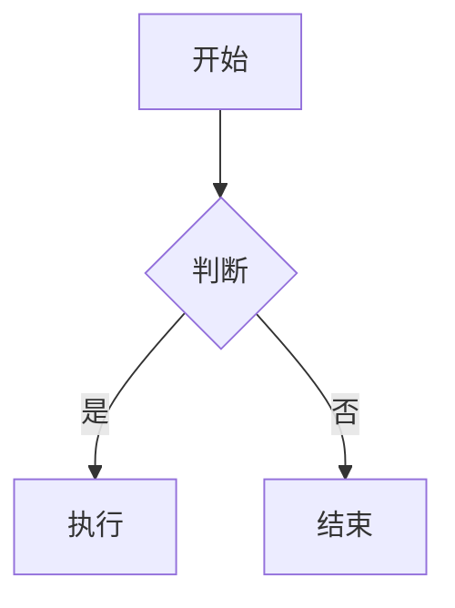
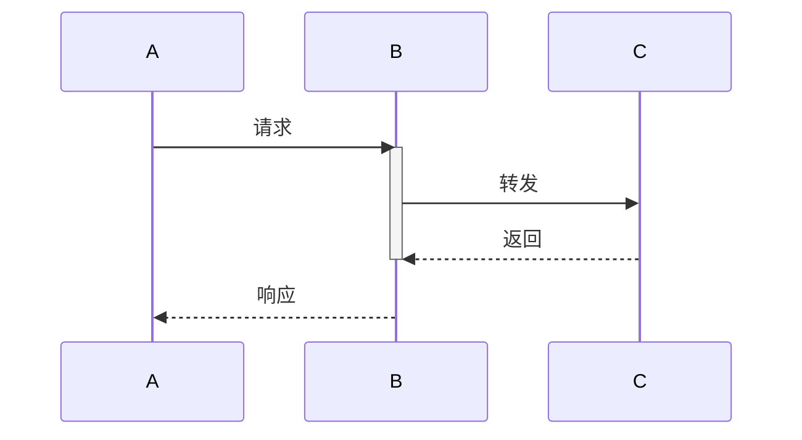
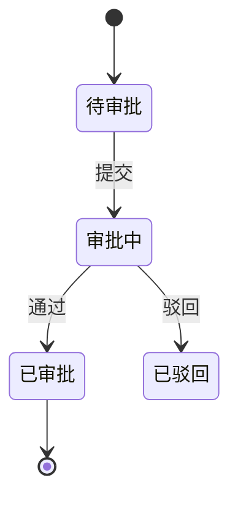
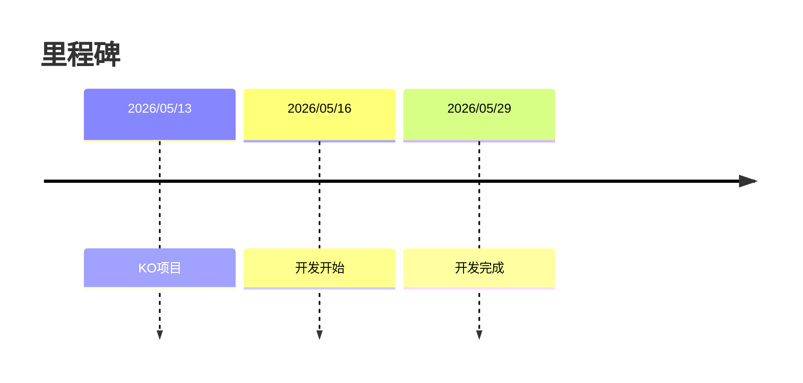

# Mermaid图表指南

## 1. 流程图 flowchart



**节点形状：**
- `[文本]` 方形
- `{文本}` 菱形（判断）
- `(文本)` 圆角
- `((文本))` 圆形

**连接线：**
- `-->` 实线箭头
- `-.->` 虚线
- `==>` 加粗

## 2. 时序图 sequenceDiagram



**消息类型：**
- `->>` 同步
- `-->>` 异步响应
- `-) 异步发送

## 3. 状态图 stateDiagram-v2



## 4. 甘特图 gantt

```mermaid
gantt
    title 项目进度
    dateFormat YYYY-MM-DD
    axisFormat %Y/%m/%d
    
    section 开发
    功能开发 :dev, 2026-05-13, 10d
    开发完成 :milestone, after dev
    
    section 测试
    SIT测试 :sit, 5d
```

**任务状态：**
- `:active,` 进行中
- `:done,` 完成
- `:milestone,` 里程碑
- `:crit,` 重要

## 5. 时间线 timeline



## PRD应用

| 场景 | 图表 |
|------|------|
| 业务流程 | flowchart TD |
| 系统交互 | sequenceDiagram |
| 状态流转 | stateDiagram-v2 |
| 项目进度 | gantt |
| 里程碑 | timeline |