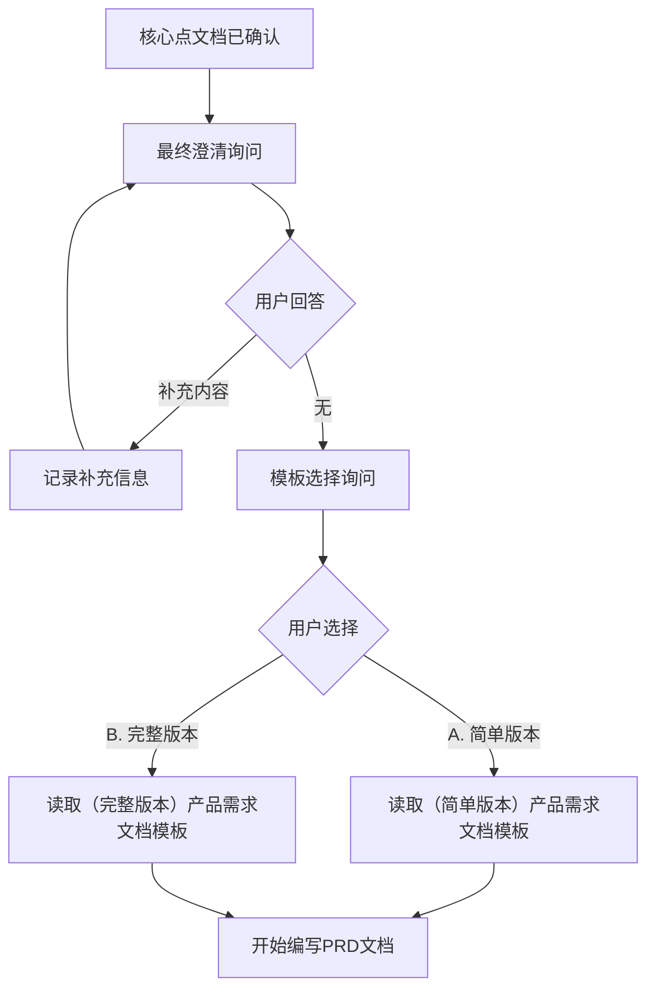

# 阶段3：PRD文档编写

## 前置条件

- 核心点文档已用户确认
- 模板路径已确认

## 流程顺序



---

## Step 1: 最终澄清询问（必须）

**在开始编写PRD文档前，必须询问用户：**

> "在开始编写PRD文档之前，还有什么信息需要补充或澄清吗？
> 
> 例如：
> - 业务规则的细节说明
> - 特殊场景的处理逻辑
> - 界面交互的具体要求
> - 与其他系统的集成细节
> 
> 请补充需要澄清的内容，或回答"无"开始编写。"

### 用户回答处理

| 用户回答 | 处理方式 |
|----------|----------|
| 补充内容 | AI记录补充信息，更新核心点文档，再次询问 |
| "无" | 开始执行PRD编写流程 |
| "返回核心点" | 回退到阶段2重新分析 |

### 补充信息记录

用户补充的内容记录到核心点文档的"补充说明"章节：

```markdown
## 七、补充说明（最终澄清）

> 以下内容在PRD编写前由用户补充

{用户补充的内容}
```

---

## Step 2: 模板选择询问（必须）

**用户回答"无"后，进行模板选择询问：**

使用AskUserQuestion工具询问：

> "请选择需求文档模板版本：
> 
> | 选项 | 适用场景 |
> |------|----------|
> | **A. 简单版本** | 内部优化、功能增强 |
> | **B. 完整版本** | 商业化产品、新项目 |
> 
> 请输入选择：A 或 B"

### 用户选择处理

| 用户选择 | 处理方式 |
|----------|----------|
| A | 读取简单版本模板 `（简单版本）产品需求文档` |
| B | 读取完整版本模板 `（完整版本）产品需求文档` |

### 模板路径拼接

```
完整路径 = {文档仓库根目录} + {相对路径}
```

| 版本 | 相对路径 |
|------|----------|
| 简单版本 | `projects/workflow/prd-workflow/（简单版本）产品需求文档` |
| 完整版本 | `projects/workflow/prd-workflow/（完整版本）产品需求文档` |

文档仓库根目录从 `~/.claude/projects/prd-workflow/memory/prd_config.md` 获取。

### 模板读取确认

读取模板后确认：

> "已加载 **{版本名称}** 模板，开始编写PRD文档..."

---

## Step 3: 文档编写

### Step 1: 基础章节

| 章节 | 来源 | Obsidian特性 |
|------|------|--------------|
| 文档变更日志 | 需求负责人+日期 | 标准表格 |
| 业务背景 | 核心点文档 | 双链 `[[]]` |
| 期望时间线 | 用户输入 | `mermaid timeline` |
| 项目联系人 | 过程文件 | 标准表格 |
| 需求背景 | 核心点文档 | Callout |

### Step 2: 流程图章节

根据功能范围生成Mermaid：
- `flowchart TD` - 业务流程
- `sequenceDiagram` - 系统交互
- `stateDiagram-v2` - 状态流转

### Step 3: 需求列表

从核心点转换：
- PC端需求表格
- 移动端需求表格（如有）
- 接口对接表格（如有）

人天填写：
- 需求分析：估算值
- 开发/测试/实施：0（待评审）

### Step 4: 风险评估

从核心点风险预判转换

### Step 5: 安全隐私

- 安全：默认"无新权限要求"
- 隐私：默认"无"

### Step 6: 项目成本

- 需求调研：估算值
- 其他：0

### Step 7: 空章节

填写"无"，不删除结构

### Step 8: 决策记录

保留空框架供后续补充

---

## Frontmatter状态定义

**PRD文档必须包含状态frontmatter：**

```markdown
---
name: {需求名称}需求文档
description: {需求简要描述}
status: 编写中
priority: P0
created_time: 2026-05-12
updated_time: 2026-05-12
owner: {需求负责人}
project: {项目集}/{系统}
type: 主版本_功能优化|项目定制化功能
---
```

### 状态流转

| 状态值 | 说明 | 触发时机 |
|--------|------|----------|
| 编写中 | 文档编写阶段 | 创建时默认 |
| 待评审 | 等待开发评审 | PRD完成确认后 |
| 开发中 | 开发实施阶段 | 评审通过后 |
| 测试中 | 测试阶段 | 开发完成后 |
| 已上线 | 已部署上线 | UAT通过后 |

### 状态更新时机

AI在以下时机自动更新状态：

| 时机 | 更新状态 |
|------|----------|
| PRD完成用户确认 | `待评审` |
| 甘特图生成后 | 保持 `待评审` |
| 用户手动要求 | 按用户指定更新 |

---

## Obsidian特性

### 双链
`[[相关文档]]`

### Dataview
```dataview
TABLE priority, status
FROM "路径"
```

### Callout
```markdown
> [!warning] 注意
> 重要提示内容
```

---

## 输出自检机制

**PRD输出前必须执行自检：**

### 自检清单

| 检查项 | 规则 | 处理 |
|--------|------|------|
| 必填章节完整性 | 文档变更日志、业务背景、需求列表必须有内容 | 缺失则补充 |
| 表格数据完整性 | 需求列表不能只有标题行 | 至少有1条需求 |
| Mermaid语法检查 | 流程图能正确渲染（关键字完整） | 修正语法 |
| Frontmatter完整 | status、priority、created_time存在 | 补充缺失字段 |
| 双链引用检查 | 引用格式正确 `[[文件名]]` | 修正格式 |

### 自检执行时机

PRD文档生成后，AI自动执行自检：

```
1. 读取生成的PRD文档
2. 按检查项逐一验证
3. 发现问题直接修正
4. 输出自检报告
```

### 自检报告格式

```markdown
## PRD文档自检报告

**文档：** {需求名称}需求文档.md

| 检查项 | 结果 | 备注 |
|--------|------|------|
| 必填章节 | ✓ | 全部完整 |
| 表格数据 | ✓ | 需求列表有3条 |
| Mermaid语法 | ✓ | 2个流程图正确 |
| Frontmatter | ✓ | 状态字段已添加 |

**自检通过，文档已准备提交确认。**
```

---

## 输出

**文件：** `{需求名称}需求文档.md`

**位置：** `{需求名称}/需求文档/`

## 阶段跳转判断

根据核心点：
- 涉及前端 → 询问是否需要原型，再询问是否使用Git仓库
- 不涉及前端 → 提示跳过原型

### PRD确认后的Git询问流程

**PRD确认后，询问是否需要原型：**

> "是否需要生成HTML原型？
> 
> | 选项 | 说明 |
> |------|------|
> | **A. 需要** | 本次需求涉及前端页面变更 |
> | **B. 不需要** | 仅后端逻辑变更或前端改动极小 |
> 
> 请选择："

| 用户选择 | 处理 |
|----------|------|
| A（需要） | 继续询问是否使用Git仓库 |
| B（不需要） | 跳转到阶段5（甘特图）或结束 |

**用户选择需要原型后，询问是否使用Git仓库：**

> "是否使用Git仓库读取前端组件信息？
> 
> | 选项 | 说明 |
> |------|------|
> | **A. 使用Git** | 从Git仓库读取前端组件对照文档，精准生成增量原型 |
> | **B. 不使用Git** | 直接根据PRD生成原型，不参考现有代码 |
> 
> 请选择："

| 用户选择 | Git配置状态 | 处理 |
|----------|------------|------|
| A（使用Git） | 未配置 | 执行Git配置流程，然后进入阶段4 |
| A（使用Git） | 已配置 | 直接进入阶段4 |
| B（不使用Git） | - | 直接进入阶段4 |

### Git配置检测

读取 `~/.claude/projects/prd-workflow/memory/git_config.md`：

| 状态 | 处理 |
|------|------|
| 不存在 | 执行Git配置流程（参考06-git-config.md） |
| 存在 | 使用已有配置，直接进入阶段4 |

## 用户确认处理

- 简单修改 → 对话告诉AI
- 复杂修改 → 用户自编辑，回复"已确认"

### 中途变更处理

如用户在确认时说"功能范围变了"：
- 提示返回阶段1重新分析核心点
- 用户确认后重新执行阶段2