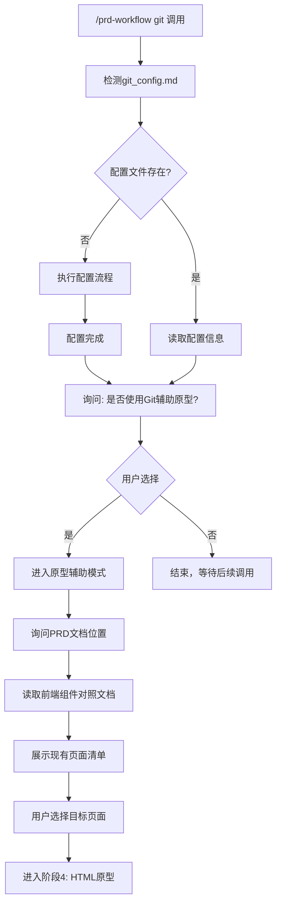

# Git配置与原型辅助阶段

## 命令功能

`/prd-workflow git` 是一个智能命令，根据当前配置状态执行不同流程：

| 配置状态 | 执行流程 |
|----------|----------|
| **未配置** | 执行Git配置流程 |
| **已配置** | 执行"是否使用Git仓库辅助绘制原型"询问 |

---

## 流程图



---

## 流程A：未配置时执行配置

### Step 1: 检测配置状态

检查 `~/.claude/projects/prd-workflow/memory/git_config.md` 是否存在：

| 状态 | 处理 |
|------|------|
| 不存在 | 进入配置流程 |
| 存在 | 跳转到流程B |

---

### Step 2: 询问是否配置

> "检测到尚未配置Git仓库访问。
> 
> 是否配置Git仓库访问？
> 
> | 选项 | 说明 |
> |------|------|
> | **是** | 配置后可读取前端组件对照文档，生成精准原型 |
> | **否** | 不配置，后续生成原型时不参考现有代码 |
> 
> 请选择："

| 用户选择 | 处理 |
|----------|------|
| 是 | 继续配置流程 |
| 否 | 结束，提示可随时调用此命令配置 |

---

### Step 3: 确认Git仓库地址

> "Git仓库地址：
> 
> **默认：** `http://git.pro.yhglobal.cn`
> 
> 请确认使用默认地址，或输入其他地址："

| 用户输入 | 处理 |
|----------|------|
| 确认（回车/默认） | 使用默认地址 |
| 输入其他地址 | 使用用户输入的地址 |

---

### Step 4: 输入个人访问令牌

> "请输入GitLab个人访问令牌：
> 
> **获取方式：**
> 1. 登录 GitLab → Settings → Access Tokens
> 2. 创建新令牌，勾选 `read_api`、`read_repository` 权限
> 3. 复制生成的令牌（只显示一次，妥善保存）
> 
> 请输入令牌："

用户输入令牌后，AI进行验证。

---

### Step 5: 验证令牌

使用GitLab API验证令牌：

```bash
curl -s -H "PRIVATE-TOKEN: {令牌}" "{Git仓库地址}/api/v4/user"
```

| 响应状态 | 处理 |
|----------|------|
| 成功（返回用户信息） | 继续获取项目列表 |
| 失败（401或其他错误） | 提示错误，重新输入令牌 |

**错误提示：**
> "令牌验证失败，请检查：
> - 令牌是否正确
> - 令牌是否有 `read_api` 权限
> - 令牌是否已过期
> 
> 请重新输入令牌："

---

### Step 6: 获取用户信息和项目列表

验证成功后，获取：
- 用户信息（username、email、name）
- 可访问前端项目列表

```bash
curl -s -H "PRIVATE-TOKEN: {令牌}" "{Git仓库地址}/api/v4/projects?per_page=100"
```

筛选前端项目（包含 `frontend`、`web`、`ui` 等关键字）。

---

### Step 7: 生成配置文件

使用Write工具创建 `git_config.md`：

```markdown
---
name: git_config
description: "内部Git仓库访问配置"
type: reference
private: true
---

# Git仓库配置

## GitLab信息

**仓库地址：** `{用户确认的地址}`

**访问令牌：** `{用户输入的令牌}`

## 用户信息

**用户名：** `{从API获取}`

**邮箱：** `{从API获取}`

**显示名称：** `{从API获取}`

## 可访问前端项目

| 项目路径 | 项目名 | 链接 |
|----------|--------|------|
| {项目路径} | {项目名} | {web_url} |

---

**配置时间：** {当前日期}

**注意：此文件包含敏感信息，请勿同步到GitHub！**
```

---

### Step 8: 配置完成

> "Git配置完成！
> 
> **配置信息：**
> - 仓库地址：`{地址}`
> - 用户名：`{用户名}`
> - 可访问前端项目：{数量}个
> 
> 配置已保存，后续可直接使用Git仓库辅助原型生成。"

配置完成后，自动进入流程B（询问是否使用Git辅助原型）。

---

## 流程B：已配置时执行原型辅助询问

### Step 1: 显示配置信息

> "检测到Git仓库已配置：
> 
> | 配置项 | 信息 |
> |--------|------|
> | 仓库地址 | `{地址}` |
> | 用户名 | `{用户名}` |
> | 配置时间 | `{日期}` |
> | 可访问项目 | {数量}个 |
> 
> 可用前端项目：
> 
> | 项目路径 | 项目名 |
> |----------|--------|
> | {项目路径} | {项目名} |
> 
> ---

### Step 2: 询问是否使用Git辅助原型

> "是否使用Git仓库辅助绘制原型？
> 
> | 选项 | 说明 |
> |------|------|
> | **A. 使用Git** | 从Git仓库读取前端组件对照文档，精准生成增量原型 |
> | **B. 不使用Git** | 直接根据PRD生成原型，不参考现有代码 |
> | **C. 重新配置** | 当前配置有问题，需要重新配置Git访问 |
> 
> 请选择："

| 用户选择 | 处理 |
|----------|------|
| A（使用Git） | 进入Step 3 |
| B（不使用Git） | 结束，提示可随时调用此命令 |
| C（重新配置） | 删除旧配置，返回流程A |

---

### Step 3: 询问PRD文档位置

> "请提供需要绘制原型的PRD文档路径："
> 
> 例如：`费用审批/需求文档/费用审批需求文档.md`

用户提供路径后，AI读取PRD文档。

---

### Step 4: 询问项目模块

> "请选择需要读取的前端项目：
> 
> | 序号 | 项目路径 | 项目名 |
> |------|----------|--------|
> | 1 | {项目路径} | {项目名} |
> 
> 请输入序号："

用户选择后，AI询问具体模块：

> "请输入需要读取的模块信息：
> 
> - **模块名：** 如 费用管理、订单管理、审批模块..."

---

### Step 5: 读取前端组件对照文档

使用GitLab API读取文档：

```bash
curl -s -H "PRIVATE-TOKEN: {令牌}" \
  "{Git仓库地址}/api/v4/projects/{项目ID}/repository/files/docs%2Ffrontend-components%2Emd?ref=main"
```

解码base64内容，解析页面清单。

---

### Step 6: 展示现有页面清单

> "从Git仓库获取到以下页面：
> 
> | 序号 | 页面名称 | 文件路径 |
> |------|----------|----------|
> | 1 | 费用列表页 | `/views/fee/list/index.vue` |
> | 2 | 费用详情页 | `/views/fee/detail/index.vue` |
> | 3 | 费用审批页 | `/views/fee/approval/index.vue` |
> 
> 请选择需要参考的页面（可多选）："

用户选择后，AI读取对应Vue/HTML文件内容。

---

### Step 7: 进入原型阶段

> "已读取Git仓库中的前端组件信息。
> 
> 现在进入阶段4（HTML原型），基于现有页面结构生成增量原型..."

**自动跳转到阶段4流程。**

---

## 独立调用场景

| 场景 | 命令效果 |
|------|----------|
| 首次配置Git访问 | 执行配置流程 |
| 已配置，想使用Git辅助原型 | 执行原型辅助询问 |
| 已配置，想重新配置 | 选择"重新配置"选项 |
| 查看当前配置信息 | 直接显示配置信息 |

---

## 安全说明

| 文件 | 是否同步到GitHub |
|------|------------------|
| `memory/git_config.md` | ❌ 不同步（包含令牌） |
| `memory-templates/git_config.md` | ✓ 同步（只是模板，不含令牌） |

**Git配置文件位于本地memory目录，不会被推送到GitHub Skill仓库。**