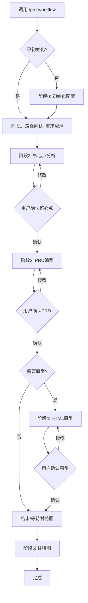

# PRD Workflow 使用手册

> 产品需求文档工作流 Skill - 从需求澄清到PRD、原型、甘特图的完整流程

---

## 一、快速开始

### 1.1 安装

通过 Claude Code Plugins 安装本 Skill。

安装后文件位置：
```
~/.claude/skills/prd-workflow/
├── skill.md                    # 主Skill文件
├── stages/                     # 各阶段逻辑
├── memory-templates/           # 配置模板（随Skill分发）
├── docs/                       # 设计文档
├── references/                 # 参考资料
└── templates/                  # 组件配置模板
```

### 1.2 首次运行初始化

首次调用 `/prd-workflow` 时，会自动执行初始化：

1. **检测配置目录** - 检查 `~/.claude/projects/prd-workflow/memory/` 是否存在
2. **复制配置模板** - 从 `memory-templates/` 复制到个人配置目录
3. **引导填写配置** - 询问文档仓库根目录（必须）
4. **完成初始化** - 自动进入需求澄清阶段

**初始化配置项：**

| 配置项 | 是否必须 | 说明 |
|--------|----------|------|
| 文档仓库根目录 | ✓ 必须 | PRD文档存放的根路径 |
| 用户身份信息 | 可选 | 角色、职责等，可跳过 |

---

## 二、调用方式

### 2.1 基本命令

在 Claude Code 对话框中输入：

| 命令 | 功能 | 流程 |
|------|------|------|
| `/prd-workflow` | 完整流程 | 阶段0→1→2→3→4→5 |
| `/prd-workflow quick` | 快速模式 | 阶段0→1→2→3→结束 |
| `/prd-workflow html` | 仅原型 | PRD已完成，绘制HTML原型 |
| `/prd-workflow gantt` | 仅甘特图 | 开发评审后，生成甘特图 |

**注意：** 子命令（quick、html、gantt）不会在命令搜索中显示，直接输入完整命令即可。

### 2.2 快速模式说明

`/prd-workflow quick` 适用紧急需求：

| 正常模式 | 快速模式 |
|----------|----------|
| 阶段1~5全流程 | 阶段1→2→3→结束 |
| 每阶段等待确认 | 核心点确认后直接输出PRD |
| 详细询问 | 最小询问 |
| 询问模板版本 | 默认使用简单版本模板 |

快速模式自动跳过：
- HTML原型阶段
- 甘特图阶段
- 详细现状材料读取

---

## 三、工作流程阶段

### 3.1 流程概览



### 3.2 各阶段说明

| 阶段 | 输出物 | 位置 | 用户确认 |
|------|--------|------|----------|
| 0. 初始化检测 | 配置文件 | `projects/prd-workflow/memory/` | 首次运行 |
| 1. 路径确认+需求澄清 | 信息汇总 | - | 必须 |
| 2. 核心点分析 | 核心点文档 | `需求调研/` | 必须 |
| 3. PRD文档编写 | PRD文档 | `需求文档/` | 必须 |
| 4. HTML原型 | 原型HTML | `HTML原型/` | 询问确认 |
| 5. 甘特图 | 甘特图章节 | PRD新增章节 | 可选 |

---

## 四、输出目录结构

### 4.1 需求文件夹结构

每次需求会创建以下目录：

```
{需求名称}/
├── 需求调研/              ← 核心点文档
├── 需求文档/              ← PRD文档
├── 技术文档/              ← 技术设计（后续补充）
├── 测试文档/              ← 测试用例（后续补充）
├── 验收文档/              ← UAT文档（后续补充）
├── 其它文档/              ← 过程文件（会议纪要等）
└── HTML原型/              ← 前端原型
```

### 4.2 完整路径示例

```
{文档仓库根目录}/{项目集}/{系统}/需求文档/{需求类型}/{需求名称}/
```

示例：
```
/Users/张三/Documents/development/tms/ETMS/需求文档/主版本_功能优化/费用审批优化/
```

---

## 五、模板配置

### 5.1 模板文件位置

模板存放在你的文档仓库中：

```
{文档仓库根目录}/projects/workflow/prd-workflow/
├── （简单版本）产品需求文档     ← 内部优化、功能增强
└── （完整版本）产品需求文档     ← 商业化产品、新项目
```

### 5.2 模板选择

阶段3编写PRD时会询问选择：

| 选项 | 适用场景 |
|------|----------|
| **A. 简单版本** | 内部优化、功能增强 |
| **B. 完整版本** | 商业化产品、新项目 |

---

## 六、配置文件说明

### 6.1 配置目录

```
~/.claude/projects/prd-workflow/memory/
├── MEMORY.md           # 记忆索引
├── prd_config.md       # 文档仓库路径配置
├── template_paths.md   # 模板路径
├── user_profile.md     # 用户身份（可选）
├── project_contacts.md # 项目联系人
└── feedback_history.md # 输出格式偏好
```

### 6.2 关键配置：文档仓库根目录

`prd_config.md` 中配置：

```markdown
## 文档仓库路径

**根目录：** `/Users/你的用户名/Documents/development/`
```

**修改方式：** 直接编辑该文件，将路径改为你的实际文档仓库路径。

---

## 七、交互方式

### 7.1 确认方式

| 确认类型 | 处理方式 |
|----------|----------|
| 简单修改 | 对话框告诉AI，AI直接修改文档 |
| 复杂修改 | 在Obsidian编辑，完成后回复"已确认，继续" |

### 7.2 流程控制

可在任意阶段说：

| 命令 | 效果 |
|------|------|
| "返回阶段X" | 回退到指定阶段重新处理 |
| "跳过原型" | 跳过阶段4，直接结束 |
| "暂停" | 保存进度，下次继续 |
| "继续" | 从上次暂停处继续 |

### 7.3 Git操作

**Skill不自动执行Git操作**，由用户自主通过 Sourcetree 或命令行管理。

---

## 八、独立调用功能

### 8.1 仅绘制原型

适用场景：PRD文档已完成，只需绘制原型

```
/prd-workflow html
```

或直接说：
- "生成HTML原型"
- "绘制原型"

流程：
1. 询问PRD文档位置
2. 询问生成方式（修改现有页面 / 新增页面）
3. 询问现有材料来源
4. 生成带注释标注的原型

### 8.2 仅生成甘特图

适用场景：PRD完成 + 开发评审通过 + 工作量已确定

```
/prd-workflow gantt
```

或直接说："生成甘特图"

流程：
1. 从PRD提取人天和人员信息
2. 询问时间节点（KO、开发、测试、上线）
3. 生成Mermaid甘特图章节

---

## 九、输出规范

### 9.1 文档格式

- 所有文档使用 **Obsidian 兼容格式**
- 流程图使用 **Mermaid 语法**
- 空章节填写"无"，不删除模板章节

### 9.2 Obsidian特性支持

| 特性 | 用途 |
|------|------|
| 双链 `[[文件名]]` | 引用相关文档 |
| Dataview查询 | 自动汇总需求列表 |
| Callout语法 | 提示信息块 |
| Mermaid渲染 | 流程图、甘特图 |

### 9.3 文件命名规范

| 文件 | 命名规则 |
|------|----------|
| 核心点文档 | `{需求名称}需求文档核心点.md` |
| PRD文档 | `{需求名称}需求文档.md` |
| HTML原型 | `{页面名称}原型.html` |

---

## 十、常见问题

### Q1: 如何更新配置？

直接编辑 `~/.claude/projects/prd-workflow/memory/prd_config.md`，修改文档仓库根目录。

### Q2: 模板文件找不到？

检查：
1. 文档仓库根目录配置是否正确
2. `projects/workflow/prd-workflow/` 目录是否存在
3. 模板文件是否已放入

### Q3: 如何重置配置？

删除 `~/.claude/projects/prd-workflow/memory/` 目录，重新运行 `/prd-workflow` 会自动初始化。

### Q4: 多人协作如何共享？

1. Skill通过Plugins安装（共享Skill逻辑）
2. 模板文件放在各自文档仓库（各自配置路径）
3. 配置文件各自独立（个人偏好）

---

## 十一、快速参考

### 项目集与系统

| 项目集 | 系统 |
|--------|------|
| tms | ETMS、GPS、RMS、PRS |
| erpp | lsp、EAS、crm、OA |
| wms | wms、wcs、qps |

### 需求类型

- `主版本_功能优化/`
- `项目定制化功能/`

### PRD状态流转

| 状态 | 说明 | 触发时机 |
|------|------|----------|
| 编写中 | 文档编写阶段 | 创建时默认 |
| 待评审 | 等待开发评审 | PRD完成确认后 |
| 开发中 | 开发实施阶段 | 评审通过后 |
| 测试中 | 测试阶段 | 开发完成后 |
| 已上线 | 已部署上线 | UAT通过后 |

---

**使用手册版本：** 1.0  
**更新日期：** 2026-05-13  
**作者：** PRD Workflow Skill